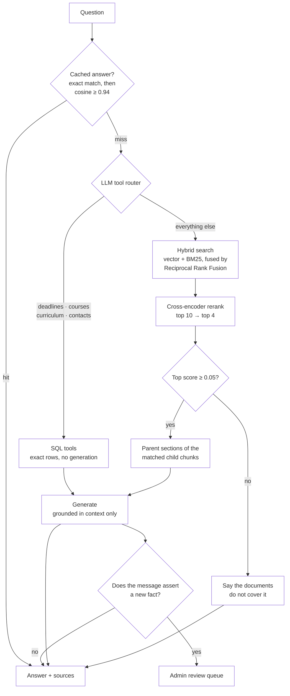
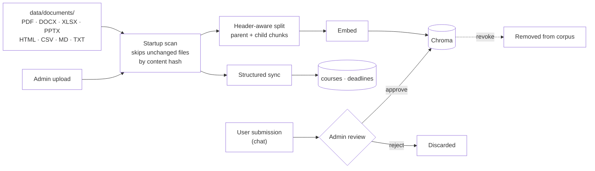

# Technical reference

The measured numbers, design rationale, and operational detail behind the
choices in the main [README](../README.md) - moved here to keep that one
readable. Nothing below is required reading to run the project; it's the
"why" for whoever is tuning, debugging, or extending it later.

## How a question is answered, in detail

The router decides between two very different sources: structured SQL for
facts that must be exact, and document search for everything else.
Ungrounded retrieval is cut off before generation rather than left to the
model to apologise for.



Two details that carry most of the retrieval quality:

- **Parent-document retrieval.** Documents are split on headers, and long
  sections are split again into smaller *child* chunks. Matching happens on
  the child (precise), but the LLM is handed the whole parent section
  (complete), so a hit on one line does not arrive without its context.
- **Relevance gate.** The reranker's top score separates answerable from
  unanswerable questions by roughly 200x on this corpus (0.70–1.00 vs
  0.00–0.003). Anything below the threshold never reaches generation, which
  is what stops the model from writing a confident answer out of irrelevant
  text.

### Ingestion



Nothing a user submits reaches the corpus unreviewed, and an approval can
be revoked later: the chunk is deleted and, if it superseded an earlier
one, that original is restored.

## Chat model providers

`config.py`'s `llm_provider` selects the chat/classifier LLM. The admin
panel can also switch it live without a restart.

- **`ollama`** (default): `ministral-3:3b` locally. No API key, no network
  call, no per-day request quota - which is why it is the default: the
  Gemini free tier repeatedly blocked both the app and the eval suite
  mid-run. Measured on the 44-case golden set (`tests/eval_golden.py`):
  **44/44**, median 4.0s per question on Apple Silicon. A CPU-only VPS will
  be slower (see Measured capacity below).
- **`gemini`**: `gemini-3.1-flash-lite` via the Gemini API. Requires
  `GEMINI_API_KEY` in `.env` - the app refuses to start without it while
  `llm_provider=gemini`. Faster per question, but bounded by a daily
  request quota.
- **`openrouter`**: OpenAI-API-compatible, with an automatic fallback to a
  second, more established model if the primary (often a free/experimental
  release) starts failing or is pulled.
- **`daily_budget_fallback_provider`**: once the live provider's own daily
  request budget is exhausted, the app can fall back to a second provider
  for the rest of the day instead of refusing new questions outright (see
  `llm_budget.py`). Logged to `BudgetFallbackEvent` and alerted to the admin
  Telegram chat, deduped against that table (not just in-process memory) so
  a restart or a cron script can't re-send the same day's alert.

Embeddings and the reranker are unaffected by this setting and always run
locally:

- **Embeddings**: `BAAI/bge-large-en-v1.5` via `sentence-transformers`
  (1024-dim), no API call and no rate limit. English-only rather than
  multilingual - measured noticeably better retrieval than a multilingual
  model on this corpus. A German question is translated to English before
  retrieval instead (see "German-language support" below), so this choice
  doesn't cost German-speaking students anything.
- **Reranker**: retrieval passes its top `retrieval_top_k` (default 10)
  hybrid (vector + BM25) hits through a `BAAI/bge-reranker-base`
  cross-encoder, keeping only the top `rerank_top_k` (default 4) most
  relevant chunks for the LLM. The model downloads on first use; the first
  request after a fresh backend start is slow while it loads.
- **Contribution gate**: a small local classifier ([Laya](https://huggingface.co/convaiinnovations/laya))
  decides whether a chat message is worth an LLM call to check for a
  correction/new fact, before `CONTRIBUTION_DETECTION_PROMPT` runs (see
  `db/contribution_gate.py`). Measured against a real LLM oracle: higher
  precision than the keyword heuristic it replaced, for a small recall
  cost - acceptable since a missed contribution still has the explicit
  "Notify Admin" button as a fallback.

### German-language support

The router (deadlines, courses, curriculum, contacts) already handles
German questions natively via its own prompt instructions. For general
document search, a German question is translated to English before
retrieval/reranking (`graph.nodes._translate_to_english`) so it matches
the same English-only corpus an equivalent English question would - the
answer itself is still generated in German. The same translation runs
before the contribution gate, since Laya's multilingual checkpoint
measured weaker than its English one at catching real corrections.
Detection (`_looks_german`) is a cheap stopword/umlaut heuristic, so an
English question never pays the extra translation call.

## Running more than one uvicorn worker

```bash
uvicorn api.main:app --workers 4 --forwarded-allow-ips 127.0.0.1
```

Supported. The two pieces of state that used to make this wrong are now
shared through SQLite:

- **Rate limits.** Counters live in `rate_limit_events`, so a limit of
  30/hour is 30/hour no matter how many workers serve it. Verified with two
  workers: 45 concurrent attempts against a 30/hour limit produced exactly
  30 allowed and 15 throttled.
- **The BM25 index.** Rebuilt from Chroma and cached per process, so a
  shared counter (`corpus_version`) is bumped on every corpus change and
  checked before each search, so a change made anywhere is picked up
  everywhere.

Correct, but rarely worth doing here - extra workers do not raise
throughput, because the bottleneck is the model server rather than the
Python process, and each one costs another full copy of the embedding
model and reranker (about 2.2 GB on a CPU-only host).

## Testing

Two suites, with different costs and different jobs.

```bash
pytest                              # API/unit suite: fast, no model needed
python -m tests.eval_golden         # answer-quality eval: needs Ollama + corpus
python -m tests.eval_golden --filter deadline --verbose
python -m tests.eval_golden --report report.json   # dump per-case retrieval
```

`pytest` covers who is allowed to do what - thread ownership, feedback
ownership, rate-limit keying, guest identities, the answer-review gate,
staff account lockout guards - against a temporary database with answer
generation stubbed. It never touches `data/sqlite/app.db`.

`tests/eval_golden.py` runs real questions through the real pipeline and
checks the answers, asserting on facts present (`expected_contains`),
known-wrong facts absent (`expected_absent`), and which document the
answer came from (`expected_source_ids`).

### Growing the eval from real failures

Rejecting or correcting an answer in the admin review queue records a
question the assistant got wrong in production. Turn those into permanent
regression cases:

```bash
PYTHONPATH=. python scripts/export_review_cases.py --dry-run
PYTHONPATH=. python scripts/export_review_cases.py
```

Corrections yield assertions automatically. Rejections have no corrected
text to diff against, so they're written with `needs_review: true` and
skipped by the runner until a human trims them. Re-running never overwrites
a hand-edited case. Scheduled weekly alongside the golden-set regression
check (see `scripts/eval_and_notify.py`).

## Deployment

Sized for the actual audience: about 50 students in total, with perhaps 5
to 10 asking something at the same moment during a busy spell. See
[`deployment.md`](deployment.md) for the VPS setup itself (secrets, deploy
script, pm2, nginx, cron schedule); this section is the capacity/safety
numbers behind it.

### Measured capacity

Ten distinct, uncached questions through the real pipeline (Apple Silicon,
GPU-accelerated Ollama, one uvicorn worker):

| Concurrent askers | Wall clock | Median wait | Slowest wait | Throughput |
|---|---|---|---|---|
| 1 | 33.7 s | 33.7 s | 33.7 s | 1.8 answers/min |
| 5 | 47.4 s | 31.1 s | 47.4 s | 6.3 answers/min |
| 10 | 89.1 s | 52.4 s | 89.1 s | 6.7 answers/min |

Every request succeeded at all three levels; the system queues rather than
failing. Throughput saturates around 6.5 answers per minute, so going from
5 to 10 simultaneous askers does not serve more people, it only doubles the
wait. That ceiling belongs to the model server, which is why more uvicorn
workers do not help and one worker is the right default.

Retrieval is not the expensive part. With no GPU at all, embedding plus
hybrid search plus reranking measures 1.2 s per question; the rest is
generation.

### Hardware

Two very different profiles depending on where generation runs:

| | `LLM_PROVIDER=ollama` | `LLM_PROVIDER=gemini` |
|---|---|---|
| Ollama (model + KV cache) | ~4 GB | not needed |
| Backend worker, CPU-only | 2.2 GB | 2.2 GB |
| OS, nginx, headroom | ~1 GB | ~1 GB |
| **Total** | **~7 GB** | **~3.5 GB** |

The 2.2 GB is measured with the device forced to CPU. On Apple Silicon the
same process reports about 300 MB resident, because Metal holds the model
weights outside the resident set - do not size a Linux VPS from a figure
taken on a Mac.

A CPU-only host changes the timing above, not just the memory: the 33.7 s
single-answer measurement was taken with GPU-accelerated generation. On a
VPS with no GPU the retrieval half stays at about 1.2 s while generation
slows by several times, so measure it on the target host before promising
students an interactive experience:

```bash
python -m tests.eval_golden --filter language --verbose
```

If that is too slow to be usable, the provider switch is the lever:
retrieval and embeddings stay local and cheap, only generation moves to
the API.

### Behind a reverse proxy

```nginx
location / {
    proxy_pass http://127.0.0.1:8000;
    proxy_set_header X-Forwarded-For $proxy_add_x_forwarded_for;
    proxy_read_timeout 180s;   # answers can take over a minute under load
    proxy_buffering off;       # required for the streamed token events
}
```

Three settings, three ways to get it wrong:

- **`proxy_read_timeout`** defaults to 60 s. The measured tail at ten
  simultaneous askers is 89 s, so the default cuts off exactly the requests
  made when the assistant is busiest.
- **`proxy_buffering off`** - without it the proxy holds the streamed
  answer and delivers it in one piece, so the user watches a blank panel
  for the whole generation instead of seeing text appear.
- **`--forwarded-allow-ips`** decides whose `X-Forwarded-For` uvicorn
  believes. Omit it behind a proxy and every request looks like it came
  from the proxy, collapsing the whole cohort into one rate-limit bucket.
  Set it to `*` and any caller can forge an address and bypass every
  limit. Name the proxy's address.

### Prompt injection

Anyone can submit text through the chat UI, and an admin may approve it
into the corpus, so retrieved context is quoted material, not trusted
input. Defences sit at three points:

- **The review gate.** Nothing a user writes reaches the corpus until an
  admin approves it. Content awaiting review is scanned for wording aimed
  at the model and flagged - advisory only, never an auto-reject, since
  the same phrases occur innocently.
- **The prompt.** A trust-boundary rule in the system prompt, plus a short
  reminder placed immediately after the quoted context.
- **Rendering.** Answers render without raw HTML and with `javascript:`
  URLs stripped; Markdown images are replaced with inert text (an image
  URL the model was induced to emit would otherwise fire on render,
  leaking the reader's IP).

Measured with `scripts/probe_injection.py`, which plants a chunk carrying
an injection and forces it into context:

| Prompt variant | Obeyed the injection |
|---|---|
| System-prompt rule only | yes |
| Context reminder only | 1 of 3 runs |
| Both (shipped) | 0 of 3 runs |

```bash
SQLITE_PATH=/tmp/probe/app.db CHROMA_PERSIST_DIR=/tmp/probe/chroma \
CHECKPOINTER_SQLITE_PATH=/tmp/probe/checkpoints.db \
PYTHONPATH=. python scripts/probe_injection.py
```

### Limits as configured

| Limiter | Allowance | Reasoning |
|---|---|---|
| `guest_limiter` | 60/hour, 300/day per IP | A 50-student cohort may open the app together from one campus address. |
| `chat_limiter` | 30/hour, 150/day per identity | An hour of exclusive use is ~390 answers. |
| `chat_ip_limiter` | 300/hour, 1200/day per IP | Backstop against identity farming. |
| `auth_limiter` | 10/5min, 50/hour per IP | Password guessing against staff accounts. |

`tests/test_capacity.py` asserts these against the cohort size, so
tightening one fails there rather than in a lecture hall.

## Maintenance and backups

`data/sqlite/app.db` holds the only copy of everything a human put into
the system by hand: staff accounts, approved submissions, admin-reviewed
answers. None of it can be regenerated from the documents.

```bash
PYTHONPATH=. python scripts/maintenance.py            # snapshot + prune
PYTHONPATH=. python scripts/maintenance.py --dry-run
```

Snapshots use `VACUUM INTO`, a consistent, compacted copy taken while the
API keeps serving. Fourteen are kept by default. The same run prunes
LangGraph checkpoints older than 14 days (a state snapshot per graph step,
mostly from eval runs, holding no user-visible data of its own).

### Retention

| Table | Default | Why |
|---|---|---|
| `chat_history` | 90 days | Nothing in the application reads it past the window. |
| `query_log` | 400 days | Admin analytics and the content-gap list are built on it. |
| guest `users` | collected once nothing references them | One row per visitor. |

```bash
PYTHONPATH=. python scripts/maintenance.py --chat-history-days 180
PYTHONPATH=. python scripts/maintenance.py --chat-history-days 0   # keep everything
```

Guest identities are only removed once no transcript, query log entry or
pending submission still points at them, and only after aging past the
transcript window. The shared `guest@aeds.local` fallback row and every
staff account are never touched.

## Catalog updates

`scripts/update_catalog.py` scrapes the AEDS module list from Stud.IP's
public pages and upserts `data/documents/catalog.csv` in place: existing
rows are updated, new modules added, hand-maintained columns like
`compulsory` left untouched. Re-ingests the file afterward (a no-op if
nothing changed).

```bash
PYTHONPATH=. python scripts/update_catalog.py
PYTHONPATH=. python scripts/update_catalog.py --skip-ingest   # fetch only
```

## Source refresh

`scripts/source_refresh.py` fetches each URL in
`data/documents/sources.json` and hashes its extracted text to notice when
a source page has changed. It never rewrites a curated document itself -
the files in `data/documents/` are cleaned, not raw scrapes (a naive
re-fetch of the deadlines page is only 4% similar to the curated table),
so an auto-overwrite would replace curated content with page furniture.
A detected change surfaces in the admin panel (`GET /admin/source-changes`)
as a word-level diff; `POST /admin/source-changes/{filename}/dismiss`
clears it once reviewed. `catalog.csv` and `semester_planning_rules.md`
have no URL in the manifest and are never touched.

A cosmetic edit below a small word-count floor is recorded as the new
baseline silently, *unless* a changed word contains a digit, which is
always significant regardless of size - the highest-stakes edit this
corpus can see is a one-token date change on the deadlines page.

```bash
PYTHONPATH=. python scripts/source_refresh.py
PYTHONPATH=. python scripts/source_refresh.py --dry-run
PYTHONPATH=. python scripts/source_refresh.py --only some_file.pdf
```

### Stage 2: LLM-drafted auto-update, for a small allowlist

For most sources, an admin re-curates the file by hand after a significant
change - the curated file is a hand-picked excerpt of a much bigger shared
page (measured: `AEDS_website_exams_faq.md` is 821 curated words excerpted
from a 2925-word university-wide FAQ), so nothing here can safely guess
which parts still belong in the excerpt.

A few sources are different: their source URL's *entire* page maps onto
the curated file (measured similarity in the high 80s/90s%, versus single
digits to low 30s% for every other source) - see `AUTO_DRAFT_ELIGIBLE` in
`scripts/source_refresh.py`. For an eligible source, a significant change
also gets an LLM-drafted replacement (temperature 0, told to change only
what the page's content changed, never invent a fact), offered with
**Approve draft** / **Reject draft** in both the admin panel and Telegram.
Approving writes the draft over the curated file and re-ingests it;
rejecting discards the draft, leaving the ordinary manual-dismiss flow in
place.

## Telegram bot

`api/telegram_bot.py` pushes Approve/Reject buttons for all three admin
review queues (source changes, submissions, pending answers) and runs on
the API server itself - a background thread started at `api/main.py`
startup long-polls Telegram, no public URL or webhook needed.

- **New submissions**: pushed immediately (infrequent, worth seeing right
  away).
- **Pending answers**: pull-only via `/pending` (a `CachedAnswer` row is
  created per distinct question, so pushing each would flood the chat).
- **Content gaps**: pull-only via `/gaps` - questions the corpus couldn't
  answer in the last 30 days, ranked by frequency.
- **Source changes / stats**: pull-only via `/sources` and `/stats`.
- **`/menu`**: a persistent reply keyboard with the four pull categories.

Every button press and pull command only works from the configured
`TELEGRAM_CHAT_ID` - treat that id as equivalent to an admin session. A
message from any other chat routes to student Q&A instead
(`api/telegram_chat.py`): the same rate limiter, budget check, semantic
cache and `run_chat` call as the web `/chat` endpoint, so a question asked
over Telegram behaves identically to one asked on the web. Each distinct
Telegram chat gets its own persistent guest identity and conversation
thread.

Updates run on a 10-worker pool - two different chats run genuinely in
parallel; two messages from the *same* chat are serialised through a
per-chat lock, since concurrent access could step the same LangGraph
checkpoint from two threads at once.
